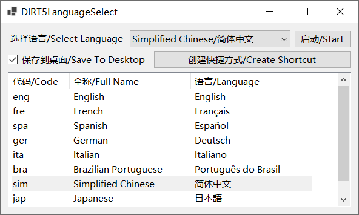

## 尘埃 5 语言选择/DIRT5LanguageSelect
一键让 [尘埃 5](https://dirtgame.com/dirt5) 使用不同语言启动，并且可以生成多种语言的快捷方式。

One click allows [DIRT 5](https://dirtgame.com/dirt5) to launch in different languages and generate shortcuts in multiple languages.

可以在右边的 [Release](https://github.com/Dreace/DIRT5LanguageSelect/releases) 下载编译好的可执行文件，使用前请先安装 [.NET 运行时](https://dotnet.microsoft.com/zh-cn/download)。

The compiled executable can be downloaded from the [Release](https://github.com/Dreace/DIRT5LanguageSelect/releases) on the right，please install the [.NET runtime](https://dotnet.microsoft.com/en-us/download) before using it.

### 支持的语言/Supported Languages
- English/English
- French/Français
- Spanish/Español
- German/Deutsch
- Italian/Italiano
- Brazilian Portuguese/Português do Brasil
- Simplified Chinese/简体中文
- Japanese/日本語
- Korean/한국어

### 实现/Implementation
启动游戏时增加 `-language` 参数。

Add the `-language` parameter when starting the game.

### 截屏/Screenshot
